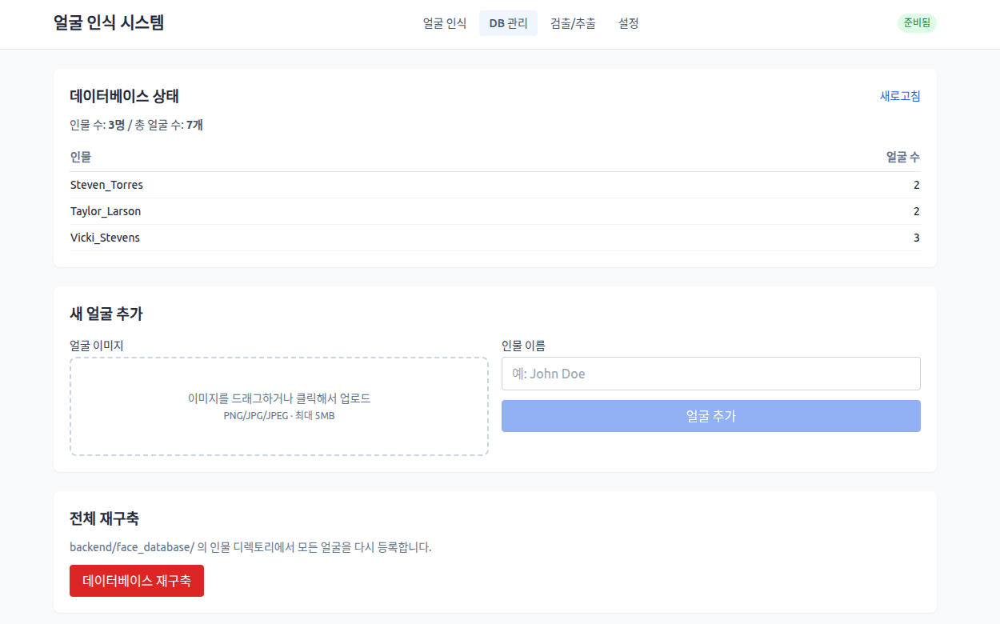
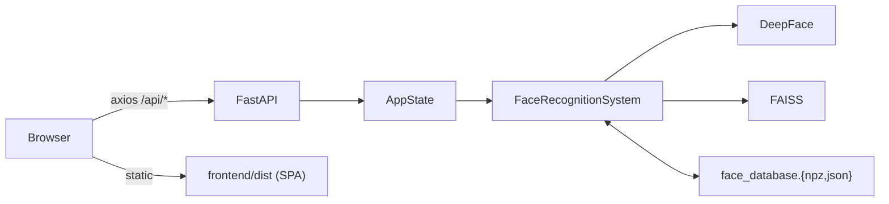

# Face Identification

> **DeepFace + FAISS** 기반 얼굴 인식 시스템
> **Vue 3 SPA** 프론트엔드 + **FastAPI** 백엔드 (단일 사용자 MVP)



업로드한 이미지에서 모든 얼굴을 검출하고, 사전 등록된 인물 데이터베이스와 매칭하여 신원과 유사도 점수를 표시합니다.

---

## 목차

- [주요 기능](#주요-기능)
- [아키텍처 한눈에 보기](#아키텍처-한눈에-보기)
- [빠른 시작](#빠른-시작)
- [실행 모드](#실행-모드)
- [API 엔드포인트](#api-엔드포인트)
- [환경변수](#환경변수)
- [데이터베이스](#데이터베이스)
- [테스트](#테스트)
- [프로젝트 구조](#프로젝트-구조)
- [운영 메모](#운영-메모)
- [문서](#문서)
- [라이선스](#라이선스)

---

## 주요 기능

- **다중 얼굴 인식** — 이미지 내 모든 얼굴을 동시 매칭, 박스+라벨 시각화 (base64 PNG 응답)
- **얼굴 검출/추출** — 검출 백엔드 9종 지원 (opencv, mtcnn, retinaface, yolov8 등)
- **얼굴 DB 관리** — 신규 등록, 인물별 통계, 디렉토리 일괄 재구축
- **모델 핫스왑** — UI에서 모델/메트릭/임계값 즉시 변경 (VGG-Face, Facenet, ArcFace 등 10종)
- **단일 포트 통합 배포** — `frontend/dist`를 FastAPI가 정적 서빙 (SPA History API fallback 포함)
- **레거시 자동 마이그레이션** — `.pkl` DB → `.npz` + `.json` 자동 전환 (역직렬화 RCE 회피)

---

## 아키텍처 한눈에 보기



전체 다이어그램(컴포넌트/시퀀스/클래스/상태)은 [`docs/architecture.md`](./docs/architecture.md), [`docs/uml.md`](./docs/uml.md) 참고.

---

## 빠른 시작

```bash
# 1) 백엔드 의존성 설치
cd backend && pip install -r requirements.txt

# 2) 프론트엔드 의존성 설치
cd ../frontend && npm install

# 3) 개발 모드 — 두 개 터미널 사용
# 터미널 A
cd backend && uvicorn api.main:app --reload --port 8000

# 터미널 B
cd frontend && npm run dev
# → http://localhost:5173
```

> 빠른 재기동: `SKIP_WARMUP=1 uvicorn api.main:app --reload --port 8000` (모델 사전 로드 생략, 첫 요청 시 지연 로딩)

---

## 환경 요구사항

| 항목 | 권장 | 비고 |
|---|---|---|
| Python | 3.10 (`py310_tf` conda env) | TF 2.x 호환 |
| Node | 18.20+ | Vite 5 / Tailwind 3 기준 |
| RAM | 4GB 이상 | VGG-Face 가중치 ~500MB + TF 런타임 |
| 디스크 | ~700MB | DeepFace 가중치 캐시 (`~/.deepface/weights/`) |

### 핵심 의존성 핀 (변경 시 충돌)

- `faiss-cpu<1.8.0` — 1.8+은 `numpy>=2.0` 요구 → TF와 충돌
- `numpy<2.0.0`, `tensorflow<2.16.0` — DeepFace/TF ABI
- `Tailwind 3.x` — Tailwind 4는 Node 20+ 요구
- `Vite 5.x` — Vite 6은 Node 18.19+, Vite 7은 20.19+ 요구

---

## 실행 모드

### A. 개발 모드 (백엔드 + 프론트엔드 분리, 권장)

```bash
# 터미널 1 — FastAPI (HMR 없이도 --reload)
cd backend
uvicorn api.main:app --reload --port 8000

# 터미널 2 — Vite dev server (HMR + /api 프록시)
cd frontend
npm run dev
# → http://localhost:5173 (/api/* 는 :8000으로 자동 프록시)
```

### B. 통합 배포 모드 (단일 프로세스, 단일 포트)

```bash
cd frontend && npm run build         # → frontend/dist 생성
cd ../backend
uvicorn api.main:app --port 8000 --workers 1
# → http://localhost:8000 (SPA + API 모두 서빙)
```

> ⚠️ `--workers` 는 반드시 **1**. 워커 N개는 VGG-Face 가중치를 N배 메모리에 적재합니다.

### C. CLI

```bash
cd backend
python main.py --image test_image.jpg --threshold 0.6 --top-k 3
```

### D. 레거시 Gradio UI (병행 운영, 추후 제거 예정)

```bash
cd backend && python app.py
# → http://localhost:7860
```

---

## API 엔드포인트

| Method | Path | 설명 |
|---|---|---|
| `GET`  | `/api/health` | 모델 로딩 상태 |
| `GET`  | `/api/options` | 사용 가능한 모델/메트릭/검출기 목록 |
| `GET`  | `/api/settings` | 현재 설정 조회 |
| `PUT`  | `/api/settings` | 설정 부분 갱신 (모델/메트릭 변경 시 DB 자동 재로드) |
| `POST` | `/api/recognize` | multipart `image` + `threshold` + `top_k` → 다중 얼굴 인식 |
| `POST` | `/api/detect` | multipart `image` → 단일 얼굴 검출/추출 |
| `GET`  | `/api/database` | DB 인물/얼굴 통계 |
| `POST` | `/api/database/faces` | multipart `image` + `identity` → 신규 얼굴 등록 |
| `POST` | `/api/database/rebuild` | `face_database/` 디렉토리에서 전면 재구축 |

OpenAPI 자동 문서: <http://localhost:8000/docs> (Swagger UI)
업로드 크기 제한: **5MB** / 지원 포맷: PNG, JPG, JPEG, BMP, TIFF

---

## 환경변수

| 변수 | 기본값 | 설명 |
|---|---|---|
| `FACE_MODEL` | `VGG-Face` | 인식 모델 (Facenet, ArcFace, SFace, ...) |
| `FACE_DISTANCE_METRIC` | `cosine` | `cosine` / `euclidean` / `euclidean_l2` |
| `FACE_DETECTOR` | `opencv` | 검출 백엔드 (mtcnn, retinaface, yolov8, ...) |
| `FACE_THRESHOLD` | `0.5` | 매칭 임계값 (0.0~1.0) |
| `FACE_TOP_K` | `3` | 반환할 상위 매치 수 |
| `FACE_USE_GPU` | `false` | `true` 시 GPU 사용 (TF가 CUDA 인식 필요) |
| `SKIP_WARMUP` | `0` | `1` 시 lifespan 모델 사전 로드 생략 (개발 편의) |
| `DEEPFACE_HOME` | `~/.deepface` | DeepFace 가중치 캐시 디렉토리 |

---

## 데이터베이스

### 영속화 포맷

- `backend/face_database.npz` — `embeddings: float32 (N, D)` (VGG-Face는 D=4096)
- `backend/face_database.json` — `{ identities, model_name, distance_metric }`
- 레거시 `.pkl` 감지 시 자동으로 npz+json으로 마이그레이션 후 pkl 제거

### 인물 디렉토리 구조

```
backend/face_database/
├── Steven_Torres/  img24.jpg, img25.jpg
├── Taylor_Larson/  img18.jpg, img19.jpg
└── Vicki_Stevens/  img1.jpg, img11.jpg, ...
```

UI에서 개별 추가하거나, 디렉토리 구성 후 `POST /api/database/rebuild` 호출.

---

## 테스트

```bash
cd backend
pytest tests/ -v
# 빠른 실행 (모델 워밍업 생략):
SKIP_WARMUP=1 pytest tests/ -v
```

**총 82개 테스트** — validators / database / face_detection / face_representation / face_recognition / visualization / build_database / **api (FastAPI TestClient 통합)**.

---

## 프로젝트 구조

```
face_identification/
├── backend/
│   ├── api/                       # FastAPI 레이어
│   │   ├── main.py                # 앱 + lifespan(warmup) + SPA 정적 서빙
│   │   ├── deps.py                # AppState (단일 인스턴스)
│   │   ├── schemas.py             # Pydantic 모델
│   │   ├── utils.py               # 업로드/인코딩 헬퍼
│   │   └── routers/               # recognition · detection · database · settings
│   ├── config.py                  # 환경변수 + TF/GPU 런타임 설정
│   ├── face_recognition.py        # FaceRecognitionSystem (Facade)
│   ├── database.py                # FaceDatabase (FAISS + 영속화)
│   ├── face_detection.py          # DeepFace.extract_faces 래퍼
│   ├── face_representation.py     # DeepFace.represent 래퍼
│   ├── visualization.py           # OpenCV bbox + 라벨
│   ├── validators.py              # 입력 검증
│   ├── build_database.py          # 디렉토리 → DB 일괄 구축
│   ├── main.py                    # CLI 진입점
│   ├── app.py                     # 레거시 Gradio UI
│   ├── requirements.txt
│   ├── face_database/             # 인물별 이미지 디렉토리
│   ├── face_database.{npz,json}   # 영속 DB
│   └── tests/                     # pytest (82개)
├── frontend/
│   ├── src/
│   │   ├── api/                   # axios 래퍼
│   │   ├── components/            # AppHeader, ImageUpload
│   │   ├── views/                 # Recognize / Database / Detect / Settings
│   │   ├── stores/                # Pinia (settings)
│   │   ├── router/                # Vue Router (4 routes)
│   │   ├── types/api.ts           # 백엔드 스키마 1:1 타입
│   │   └── App.vue, main.ts
│   ├── package.json, vite.config.ts
│   └── tailwind.config.js, postcss.config.js
├── docs/
│   ├── architecture.md            # 시스템 아키텍처 + 데이터 흐름
│   └── uml.md                     # UML (클래스/시퀀스/상태/컴포넌트)
├── demo.png
├── LICENSE
└── README.md
```

---

## 운영 메모

- **단일 사용자 가정** — 인증/세션 없음. 외부 노출 시 nginx/caddy 리버스 프록시 + 인증 레이어 추가 필요.
- **첫 인식 지연** — lifespan 사전 로딩으로 완화. 비활성화 시 첫 요청 5~10초 소요.
- **`uvicorn --reload` + lifespan** — 코드 저장마다 ~5초 워밍업 반복. 빠른 반복은 `SKIP_WARMUP=1 --reload` 조합 권장.
- **DeepFace 모델 캐시** — `~/.deepface/weights/` (첫 실행 시 인터넷에서 다운로드). 경로 변경은 `DEEPFACE_HOME` 환경변수.
- **모델 교체 시 DB 호환성** — `PUT /api/settings`로 모델 변경하면 기존 DB는 차원 불일치로 빈 상태가 됨. 새 모델로 `rebuild` 필요.

---

## 문서

| 파일 | 내용 |
|---|---|
| [`docs/architecture.md`](./docs/architecture.md) | 시스템 아키텍처, 컴포넌트 다이어그램, 데이터 흐름, 배포 |
| [`docs/uml.md`](./docs/uml.md) | UML — 클래스/시퀀스/상태/컴포넌트/유스케이스 (Mermaid) |

---

## 라이선스

MIT License — [`LICENSE`](./LICENSE) 참고.
