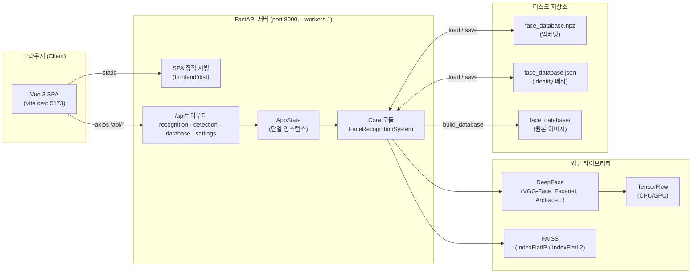
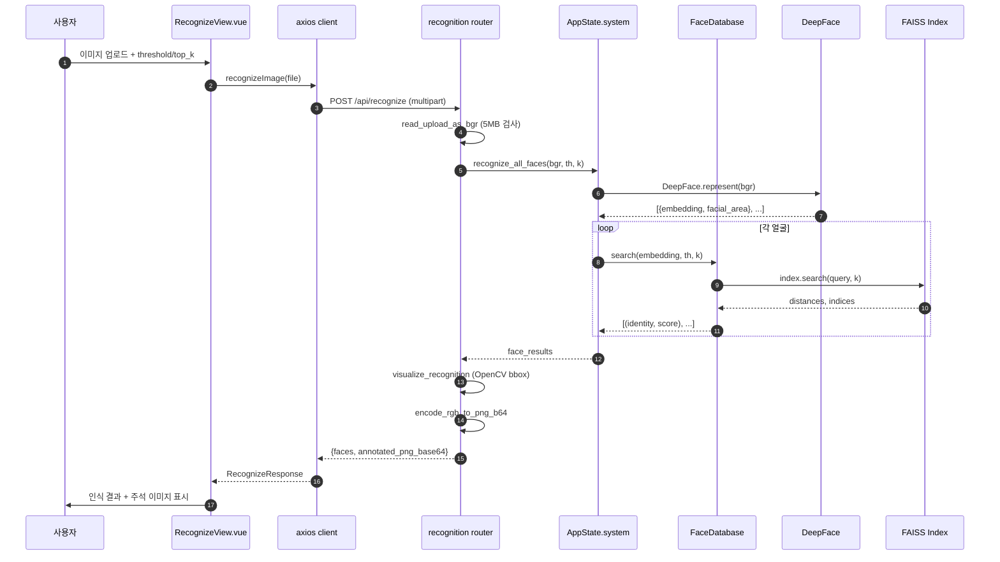
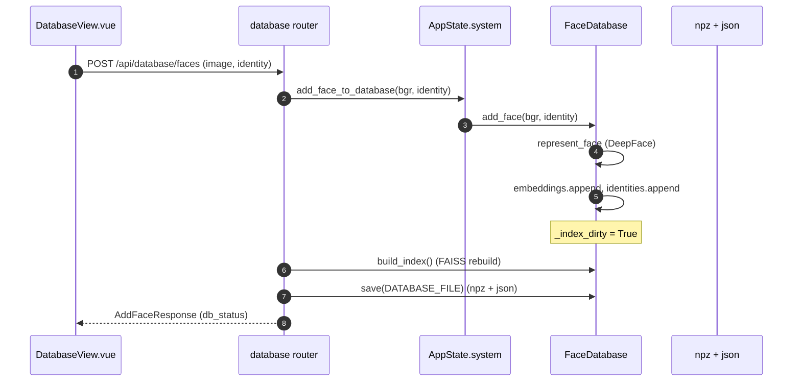
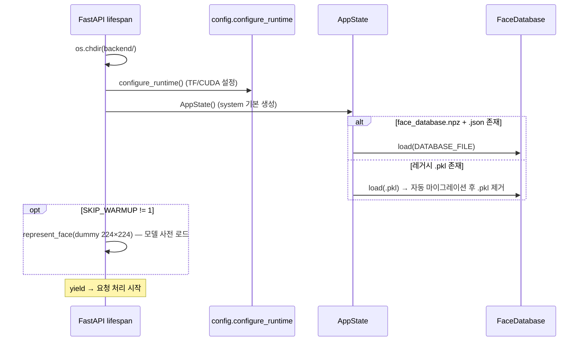
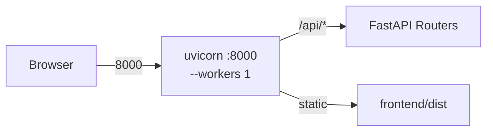

# 시스템 아키텍처

> Face Identification — DeepFace + FAISS 기반 얼굴 인식 시스템
> Vue 3 SPA 프론트엔드 + FastAPI 백엔드 (단일 사용자 MVP)
> 최종 갱신: 2026-05-17

---

## 1. 개요

본 프로젝트는 **DeepFace** 모델로 얼굴 임베딩을 추출하고 **FAISS** 인덱스로 유사 얼굴을 검색하는 얼굴 인식 시스템입니다. 백엔드는 FastAPI REST API로 추론 기능을 제공하고, 프론트엔드는 Vue 3 SPA로 업로드/시각화 UI를 담당합니다.

**핵심 책임 분리:**
- **Core 모듈** (`backend/*.py`) — DeepFace/FAISS와 직접 상호작용하는 순수 도메인 로직
- **API 레이어** (`backend/api/`) — HTTP 요청 처리, 스키마 변환, 단일 상태(AppState) 관리
- **프론트엔드** (`frontend/src/`) — Vue 3 + Pinia + Vue Router로 구성된 SPA

---

## 2. 상위 컴포넌트 다이어그램



---

## 3. 백엔드 모듈 구조

### 3.1 디렉토리 트리 (요약)

```
backend/
├── config.py              # 환경 변수, 기본값, GPU 런타임 설정
├── validators.py          # 입력 검증 (이미지 path/ndarray, threshold, top_k, identity)
├── face_detection.py      # DeepFace.extract_faces 래퍼
├── face_representation.py # DeepFace.represent 래퍼
├── database.py            # FaceDatabase (FAISS 인덱스 + 영속화)
├── face_recognition.py    # FaceRecognitionSystem (Facade)
├── visualization.py       # OpenCV bbox + 라벨 그리기
├── build_database.py      # face_database/ 디렉토리 스캔 → DB 일괄 구축
├── main.py                # CLI 진입점
├── app.py                 # 레거시 Gradio UI (병행 운영, 추후 제거)
└── api/                   # FastAPI 레이어
    ├── main.py            # FastAPI 앱 + lifespan(warmup) + SPA 정적 서빙
    ├── deps.py            # AppState (단일 사용자 상태 dataclass)
    ├── schemas.py         # Pydantic 응답/요청 스키마
    ├── utils.py           # 업로드 디코딩, base64 인코딩, DB 스키마 변환
    └── routers/
        ├── recognition.py # POST /api/recognize
        ├── detection.py   # POST /api/detect
        ├── database.py    # GET/POST /api/database, /faces, /rebuild
        └── settings.py    # GET/PUT /api/settings, GET /api/options
```

### 3.2 레이어 책임

| 레이어 | 파일 | 책임 |
|---|---|---|
| **HTTP** | `api/routers/*.py` | 요청 파싱, 검증, 스키마 변환, HTTP 에러 처리 |
| **상태** | `api/deps.py` | 앱 수명 동안 유지되는 단일 `AppState` (모델·DB·기본값) |
| **Facade** | `face_recognition.py` | 외부에 노출되는 단일 진입점 `FaceRecognitionSystem` |
| **도메인** | `database.py`, `face_detection.py`, `face_representation.py` | 임베딩 추출, 검색, 인덱스 관리 |
| **유틸** | `validators.py`, `visualization.py`, `api/utils.py` | 검증·시각화·인코딩 |
| **설정** | `config.py` | 환경변수 기반 기본값, TF/GPU 런타임 초기화 |

---

## 4. 프론트엔드 모듈 구조

### 4.1 디렉토리 트리

```
frontend/src/
├── main.ts            # Vue 앱 부트스트랩 (Pinia + Router)
├── App.vue            # 최상위 레이아웃 (AppHeader + RouterView)
├── router/index.ts    # 4개 라우트 (/recognize, /database, /detect, /settings)
├── components/
│   ├── AppHeader.vue  # 상단 네비게이션
│   └── ImageUpload.vue# 공통 이미지 업로드 위젯
├── views/
│   ├── RecognizeView.vue  # 인식 결과 + 시각화
│   ├── DatabaseView.vue   # 인물 목록 + 얼굴 추가 + 재구축
│   ├── DetectView.vue     # 얼굴 검출/추출
│   └── SettingsView.vue   # 모델/메트릭/임계값 변경
├── api/
│   ├── client.ts          # axios 인스턴스 (baseURL=/api)
│   ├── recognition.ts     # /recognize, /detect
│   ├── database.ts        # /database, /database/faces, /database/rebuild
│   └── settings.ts        # /settings, /options, /health
├── stores/
│   └── settings.ts        # Pinia store (설정 캐시 + update)
└── types/api.ts           # 백엔드 Pydantic 스키마와 1:1 대응 TS 타입
```

### 4.2 상태 관리

- **Pinia store** (`stores/settings.ts`) — 전역으로 공유되는 유일한 store. 설정(model, metric, threshold 등)을 캐시
- **View 로컬 상태** — 각 View가 자신의 데이터 페칭/표시 상태를 보유 (별도 store 없음)
- **axios client** — `/api` 프록시 경유 (dev: Vite 프록시, prod: 동일 origin)

---

## 5. 데이터 흐름

### 5.1 얼굴 인식 (Recognize)



### 5.2 얼굴 등록 (Add Face)



### 5.3 앱 부팅 (Lifespan)



---

## 6. API 엔드포인트

| Method | Path | 설명 | 응답 스키마 |
|---|---|---|---|
| GET | `/api/health` | 헬스/모델 로드 상태 | `HealthResponse` |
| POST | `/api/recognize` | 이미지 → 모든 얼굴 인식 + 시각화 | `RecognizeResponse` |
| POST | `/api/detect` | 이미지 → 단일 얼굴 검출/추출 | `DetectResponse` |
| GET | `/api/database` | DB 인물·얼굴 수 통계 | `DatabaseStatus` |
| POST | `/api/database/faces` | 얼굴 1장 등록 (영속화) | `AddFaceResponse` |
| POST | `/api/database/rebuild` | `face_database/` 전체 재구축 | `RebuildResponse` |
| GET | `/api/settings` | 현재 설정 조회 | `Settings` |
| PUT | `/api/settings` | 설정 부분 갱신 | `Settings` |
| GET | `/api/options` | 지원 모델/메트릭/검출기 목록 | `Options` |

**비-API 경로**: `frontend/dist` 존재 시 SPA 정적 서빙 + History API fallback (`/{full_path:path}` → `index.html`).

---

## 7. 배포 아키텍처

### 7.1 개발 모드 (2-process)


- `cd backend && uvicorn api.main:app --reload --port 8000`
- `cd frontend && npm run dev` (port 5173, `/api` → 8000 자동 프록시)

### 7.2 통합 배포 (1-process)



- `cd frontend && npm run build` → `cd backend && uvicorn api.main:app --port 8000 --workers 1`
- **`--workers 1` 필수**: VGG-Face 가중치 ~500MB가 워커별로 중복 적재되는 것을 방지

---

## 8. 런타임 환경 및 의존성 제약

### 8.1 실행 환경
- **Python**: `/home/duck/miniconda3/envs/py310_tf` (3.10.19)
- **Node**: v18.20.8 / npm 10.8.2

### 8.2 핵심 의존성 핀
| 패키지 | 제약 | 이유 |
|---|---|---|
| `faiss-cpu` | `<1.8.0` | 1.8+은 `numpy>=2.0` 요구 → TF와 충돌 |
| `numpy` | `<2.0.0` | TF 2.x ABI 호환 |
| `tensorflow` | `<2.16.0` | DeepFace 호환 |
| Tailwind | 3.x 고정 | Tailwind 4는 Node 20+ 필요 |
| Vite | 5.x 고정 | Vite 6은 Node 18.19+, Vite 7은 20.19+ |

### 8.3 환경 변수

| 변수 | 기본값 | 의미 |
|---|---|---|
| `SKIP_WARMUP` | `0` | `1` 시 모델 사전 로드 생략 (개발/테스트 편의) |
| `FACE_USE_GPU` | `false` | `true` 시 GPU 사용 |
| `FACE_MODEL` | `VGG-Face` | DeepFace 모델 |
| `FACE_DISTANCE_METRIC` | `cosine` | 거리 측정 |
| `FACE_DETECTOR` | `opencv` | 검출 백엔드 |
| `FACE_THRESHOLD` | `0.5` | 매치 임계값 |
| `FACE_TOP_K` | `3` | 상위 매치 개수 |

---

## 9. 영속화 포맷

**현재 포맷**: `face_database.npz` + `face_database.json`
- `.npz` — `embeddings: float32 (N, D)` (VGG-Face의 경우 D=4096)
- `.json` — `{ identities: list[str], model_name: str, distance_metric: str }`

**레거시 포맷**: `.pkl` — 자동으로 npz+json으로 마이그레이션 후 제거

**현재 DB**: 3인 (Steven_Torres, Taylor_Larson, Vicki_Stevens) × 총 7개 얼굴

---

## 10. 테스트 전략

`backend/tests/` — 총 82개 테스트
- `test_validators.py` · `test_database.py` · `test_face_detection.py` · `test_face_representation.py` · `test_face_recognition.py` · `test_visualization.py` · `test_build_database.py` · `test_api.py`
- 실행: `cd backend && pytest tests/`

---

## 11. 설계 결정 (Decision Log)

| 결정 | 이유 |
|---|---|
| Gradio → Vue 3 SPA + FastAPI 분리 | 컴포넌트 재사용·라우팅·테스트 용이성 |
| base64 PNG 응답 | 단일 사용자 MVP에서 파일 저장/CDN 불필요, JSON 단일 응답 단순화 |
| Vite `/api` 프록시 + 통합 배포 | dev는 HMR, prod는 단일 origin/포트로 CORS 회피 |
| `AppState` 단일 인스턴스 | 단일 사용자 MVP, 모델 가중치 중복 적재 방지 (`--workers 1`) |
| FAISS `IndexFlatIP` (cosine) / `IndexFlatL2` | 정확도 최우선, N<10K 규모에서 IVF/PQ 불필요 |
| npz+json (pkl 폐기) | 보안(역직렬화 RCE 회피) + 가독성 + 압축 |
