# UML 다이어그램

> Face Identification — 클래스/시퀀스/상태/컴포넌트/유스케이스 UML
> Mermaid 기반 (GitHub, VSCode `bierner.markdown-mermaid`, IntelliJ Markdown 플러그인에서 렌더링)
> 최종 갱신: 2026-05-17

---

## 1. 클래스 다이어그램 — Core 도메인

`FaceRecognitionSystem`이 외부 진입점(Facade)이고, 내부적으로 `FaceDatabase`를 합성하며 DeepFace/FAISS와 협업합니다.

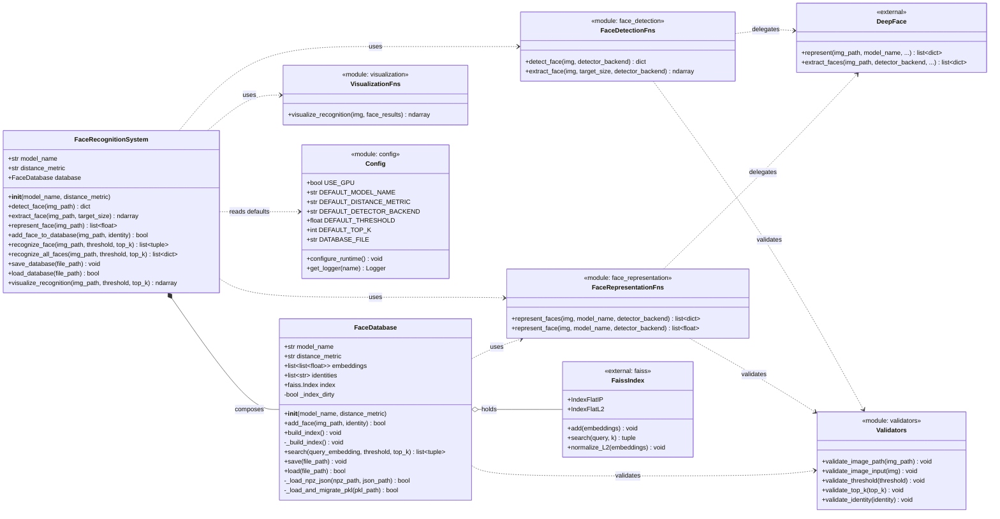

---

## 2. 클래스 다이어그램 — API 레이어 (FastAPI)

라우터는 `AppState`를 통해 도메인 계층에 접근합니다. Pydantic 스키마가 HTTP 경계의 계약을 정의합니다.

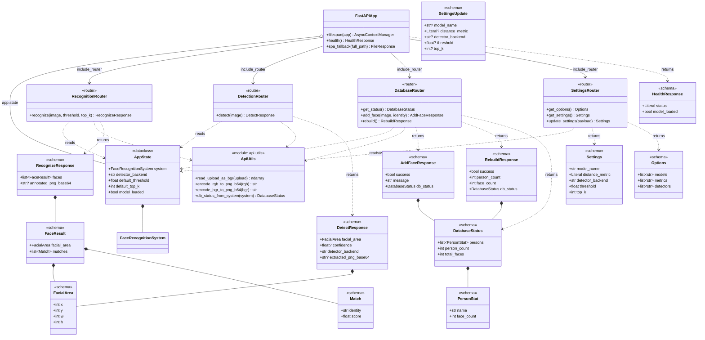

---

## 3. 클래스 다이어그램 — 프론트엔드 (Vue 3 + Pinia)

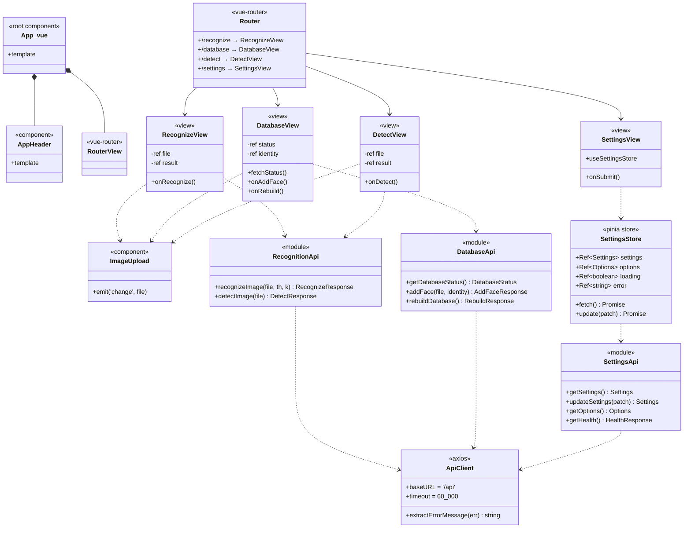

---

## 4. 시퀀스 다이어그램 — `POST /api/recognize` 전체 흐름

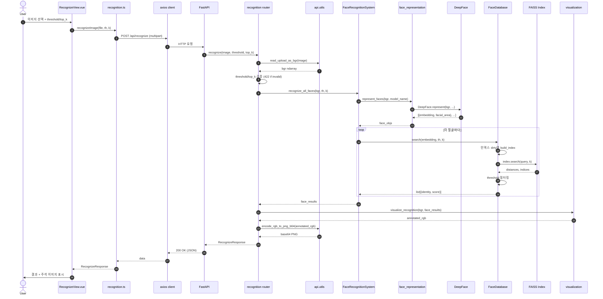

---

## 5. 시퀀스 다이어그램 — `POST /api/database/faces` (얼굴 등록)

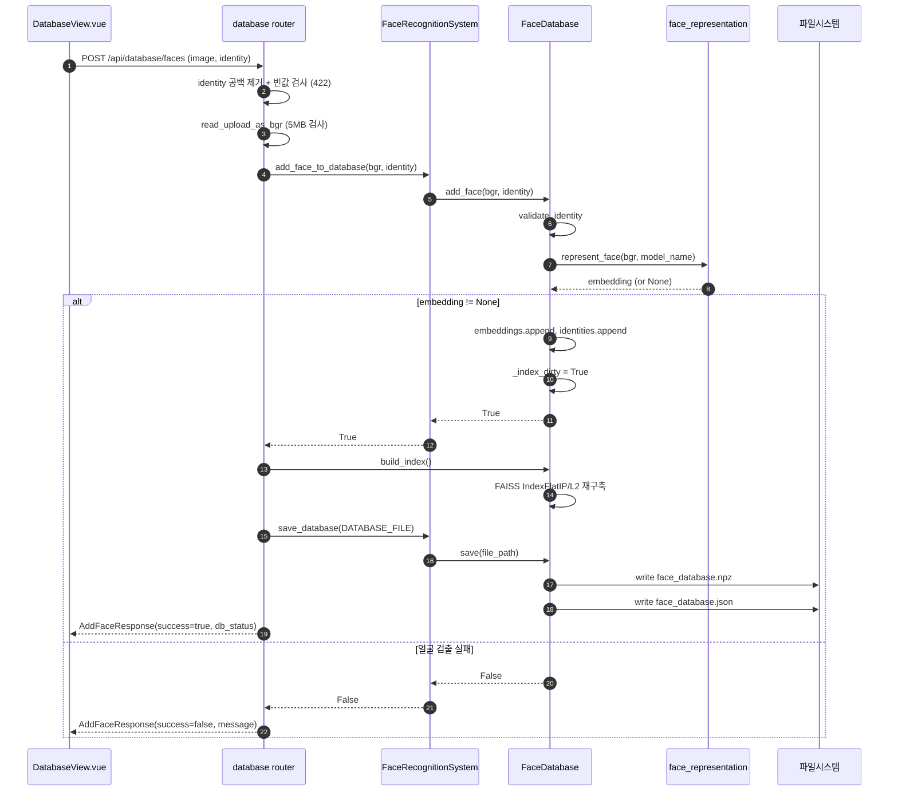

---

## 6. 시퀀스 다이어그램 — 앱 부팅 (Lifespan)

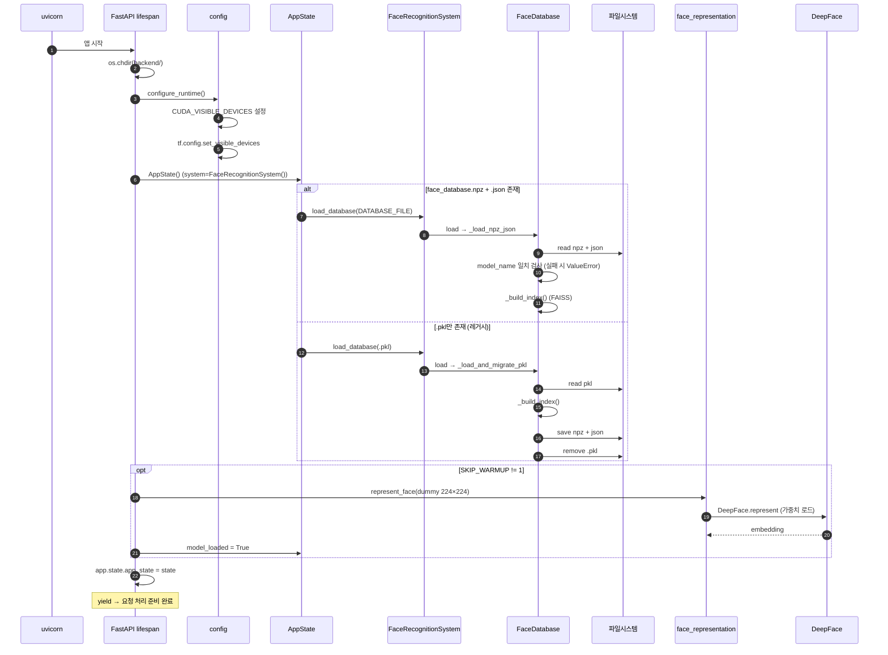

---

## 7. 시퀀스 다이어그램 — `PUT /api/settings` (모델 변경 시)

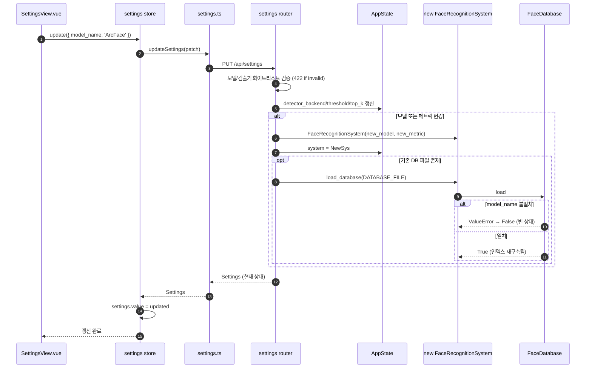

---

## 8. 상태 다이어그램 — `FaceDatabase` 인덱스 상태

`_index_dirty` 플래그로 lazy rebuild를 구현합니다.

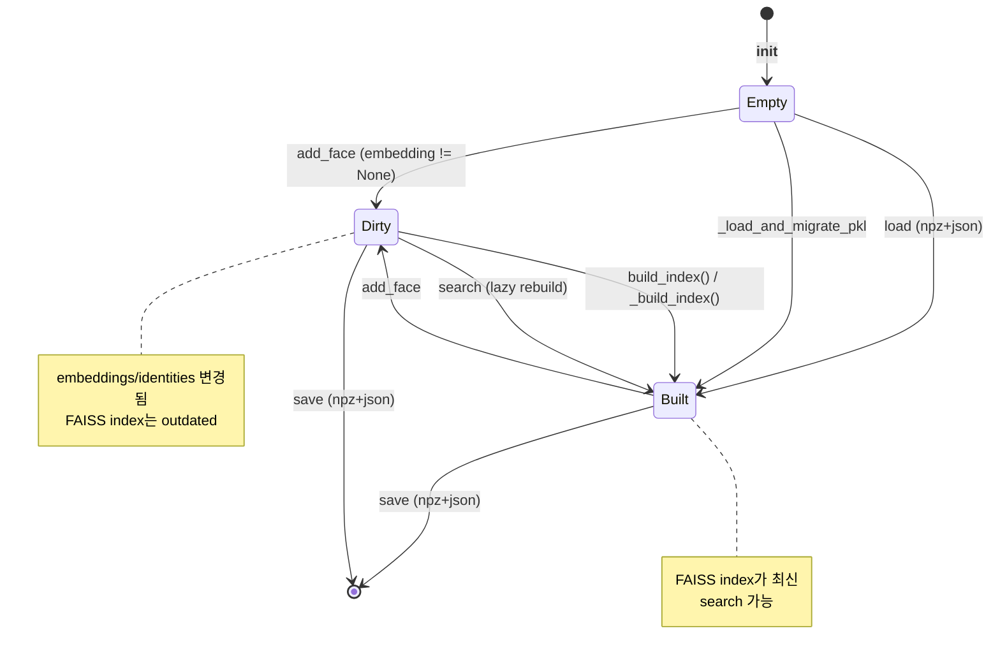

---

## 9. 컴포넌트 다이어그램 — 전체 시스템

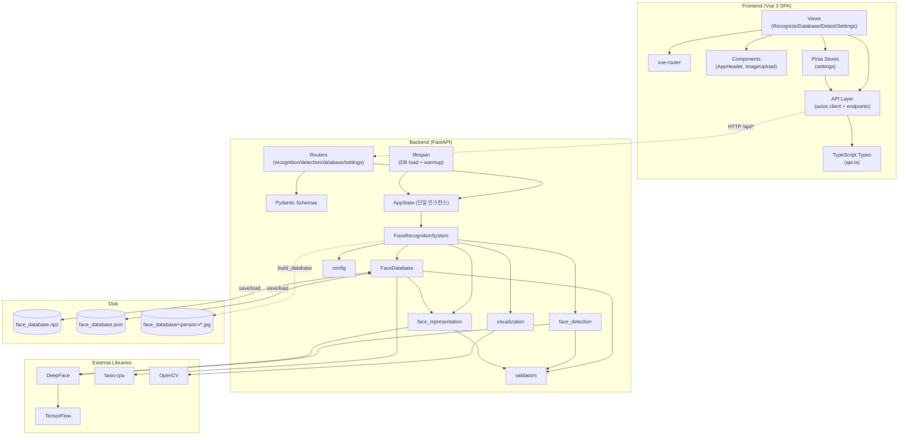

---

## 10. 유스케이스 다이어그램

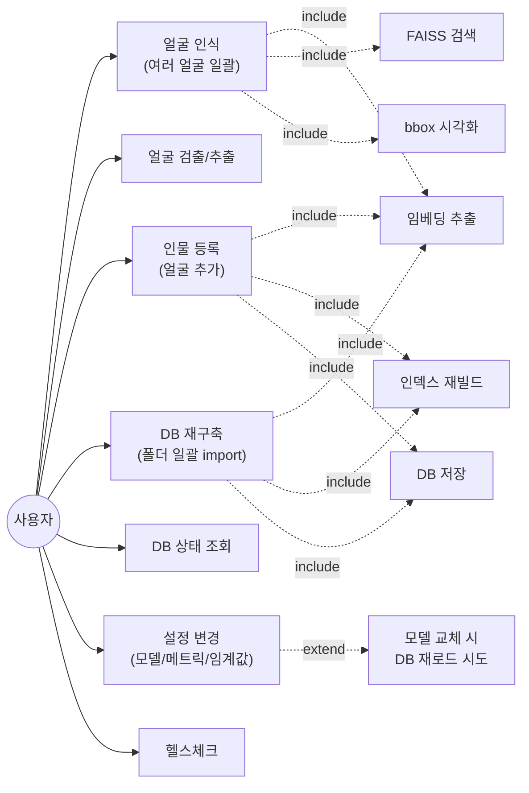

---

## 11. 클래스 다이어그램 — 입력 검증 모듈

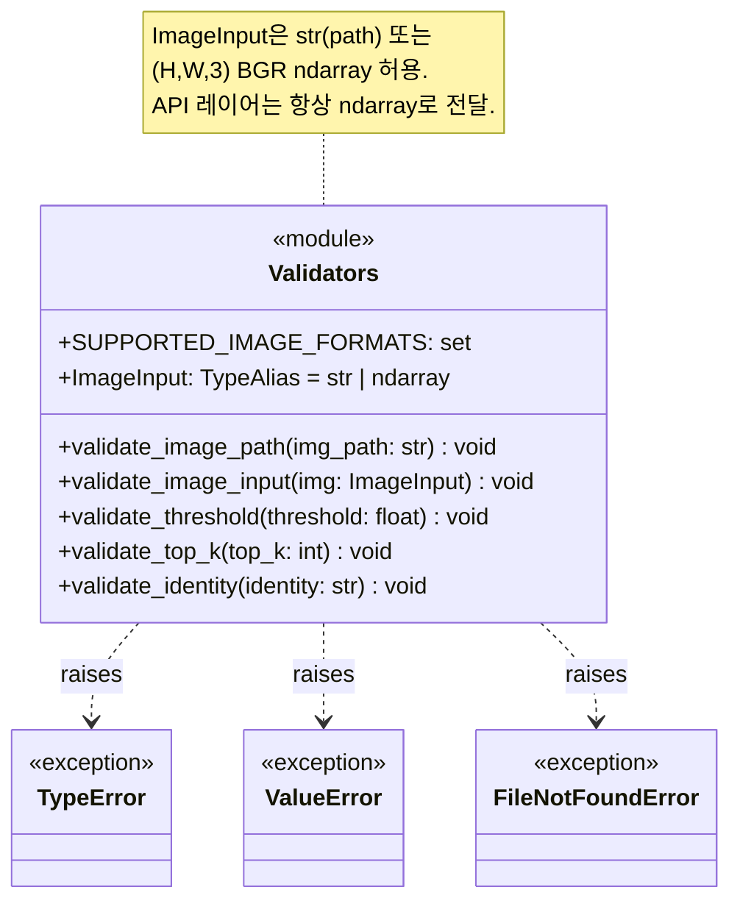

---

## 12. 렌더링 안내

- **GitHub** — `.md` 내 Mermaid 코드블록을 자동 렌더링
- **VSCode** — 확장 `bierner.markdown-mermaid` 설치 후 미리보기
- **IntelliJ/PyCharm** — Markdown 플러그인에서 Mermaid 지원 (Settings → Languages & Frameworks → Markdown → Mermaid 활성화)
- **로컬 변환** — `npx @mermaid-js/mermaid-cli -i docs/uml.md -o docs/uml.svg`
